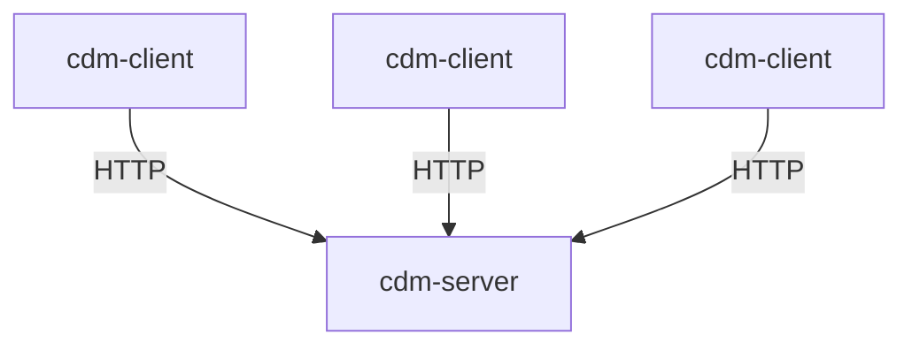
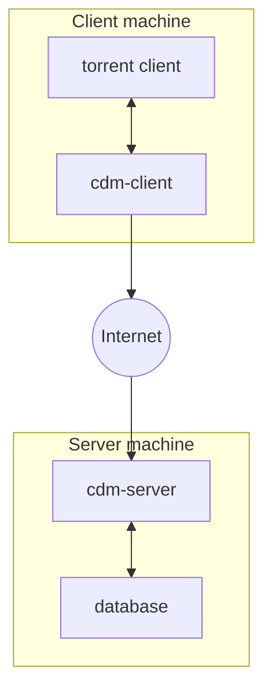
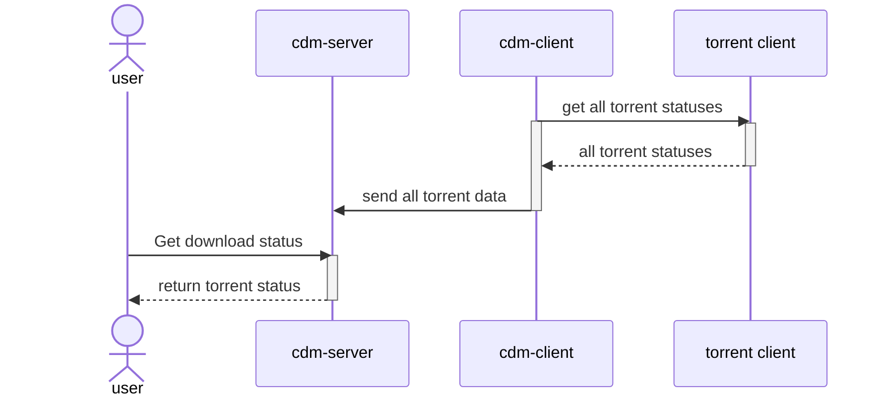
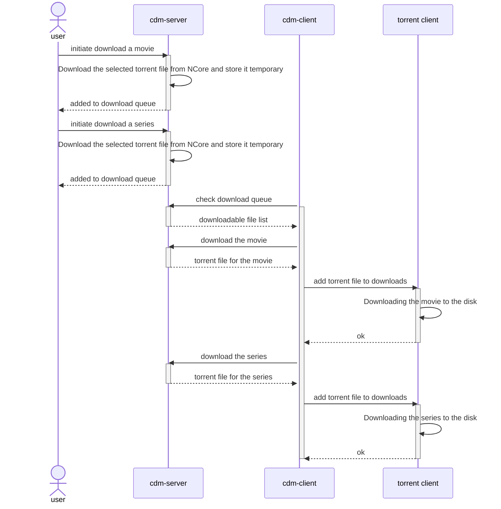

# CDMServer

## What is CDM?

Centralized Download Manager: A server-client solution for managing your downloads. Search on Ncore or TMDB and seamlessly download content to your chosen device using Transmission or QBittorrent (torrent clients).

## How to use it
For comprehensive guidance on using the webpage, refer to the [Usage Guide](doc/USAGE.md).

## How it works

This is a centralized solution where multiple clients can connect to the server, send their download status, and receive torrent files for downloading.



The client connects to the [Transmission](https://transmissionbt.com/) or [QBitTorrent](https://www.qbittorrent.org/) BitTorrent client to retrieve download information and manage downloads. It then communicates with the server to receive the downloadable torrent file and send the download status.



The client transmits download status data periodically, allowing the user to check the status in the browser.



When the user clicks on "Download" or selects a target device for downloading, the client can retrieve the chosen torrent file and add it to the torrent client.



## Available Features

### Users
- Admins can add or remove users.
- Manage user permissions (admin or regular user).
- Users can update their own passwords.
- Users can utilize their Ncore credentials for downloads.

### Devices
- Support for multiple devices.
- Share devices with multiple users across the platform.
- Retrieve a token from a device and link it to a client (one device per client).

### Downloads
- Users can search for torrents on Ncore.
- Download files to multiple devices.
- Users can view the status of their downloads.
- Users can play, pause, or delete their downloads.

### TMDB Search
- Search for movies and series using TMDB.
- Get a downloadable list of movies and series with a single click.

## Installation and configuration
Pull the container:
``` bash
docker pull ghcr.io/radaron/cdmserver:latest
```
Example docker compose file:
``` yaml
services:
  mysql:
    image: mysql:8.0
    container_name: mysql
    environment:
      MYSQL_ROOT_PASSWORD: rootpassword
      MYSQL_DATABASE: mydatabase
      MYSQL_USER: myuser
      MYSQL_PASSWORD: mypassword
    ports:
      - "3306:3306"
  redis:
    image: redis:latest
    container_name: redis
    ports:
      - "6379:6379"
  cdm-server:
    image: ghcr.io/radaron/cdmserver:latest
    container_name: cdm
    ports:
      - "8000:8000"
    depends_on:
      - mysql
      - redis
    environment:
      ADMIN_EMAIL: admin@admin.hu
      ADMIN_PASSWORD: admin
      DB_HOST: mysql
      DB_NAME: mydatabase
      DB_PASSWORD: mypassword
      DB_PORT: 3306
      DB_USER: myuser
      REDIS_HOST: redis
      REDIS_PORT: 6379
      NCORE_USERNAME: user
      NCORE_PASSWORD: password
      TMDB_API_KEY: your_tmdb_key
      SECRET_KEY: YTzqIUYPqWRewhar1veWth0WRH8d6MMpqP5BQp_pEB8=
      ALLOWED_ORIGINS: https://mydomain.com
```
- The `ADMIN_EMAIL` and `ADMIN_PASSWORD` is the default admin credentials
- `DB_` variables should be the mysql database related variables
- `NCORE_USERNAME` and `NCORE_PASSWORD` also need for the searching logic
- `TMDB_API_KEY` - Create your own key [here](https://www.themoviedb.org/settings/api).
- `SECRET_KEY` is need session and credential encryption. It is a 32 url-safe base64-encoded string.

## See also
* [cdm client](https://github.com/radaron/CDMClient)
* [browser extension](https://github.com/radaron/CDMBrowserExtension)
