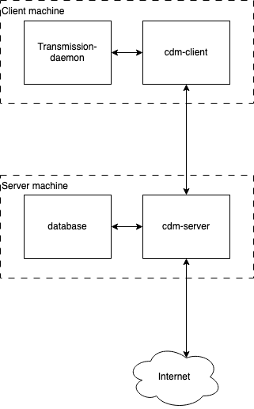
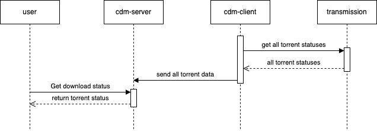
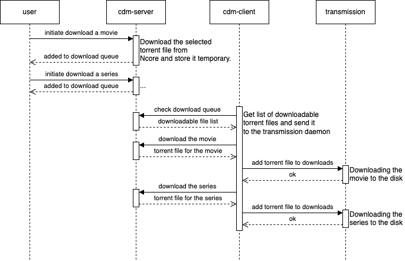

# CDMServer

## What is CDM?

Centralized Download Manager: A server-client solution for managing your downloads. Search on Ncore or IMDb (OMDb) and seamlessly download content to your chosen device using Transmission (a torrent client).

## How to use it
For comprehensive guidance on using the webpage, refer to the [Usage Guide](doc/USAGE.md).

## How it works

This is a centralized solution where multiple clients can connect to the server, send their download status, and receive torrent files for downloading.

[](https://app.diagrams.net/?tags=%7B%7D&lightbox=1&highlight=0000ff&edit=_blank&layers=1&nav=1&dark=auto#Hradaron%2FCDMServer%2Fmaster%2Fdoc%2Fimages%2Fdiagrams%2Fblocks_high.png)

The client connects to the [Transmission](https://transmissionbt.com/) BitTorrent client to retrieve download information and manage downloads. It then communicates with the server to receive the downloadable torrent file and send the download status.

[](https://app.diagrams.net/?tags=%7B%7D&lightbox=1&highlight=0000ff&edit=_blank&layers=1&nav=1&dark=auto#Hradaron%2FCDMServer%2Fmaster%2Fdoc%2Fimages%2Fdiagrams%2Fblocks.png)

The client transmits download status data every 30 seconds, allowing the user to check the status in the browser.

[](https://app.diagrams.net/?tags=%7B%7D&lightbox=1&highlight=0000ff&edit=_blank&layers=1&nav=1&dark=auto#Hradaron%2FCDMServer%2Fmaster%2Fdoc%2Fimages%2Fdiagrams%2Fsequence_status.png)

When the user clicks on "Download" or selects a target device for downloading, the client can retrieve the chosen torrent file and add it to Transmission.

[](https://app.diagrams.net/?tags=%7B%7D&lightbox=1&highlight=0000ff&edit=_blank&layers=1&nav=1&dark=auto#Hradaron%2FCDMServer%2Fmaster%2Fdoc%2Fimages%2Fdiagrams%2Fsequence_download.png)

## Available Features

### Users
- Admins can add or remove users.
- Manage user permissions (admin or regular user).
- Users can update their own passwords.
- Users can utilize their Ncore credentials for downloads.

### Devices
- Support for multiple devices.
- Share devices with multiple users across the platform.
- Retrieve a token from a device and link it to a client (one device per client).

### Downloads
- Users can search for torrents on Ncore.
- Download files to multiple devices.

### IMDb Search
- Search for movies and series using IMDb (OMDb database).
- Get a downloadable list of movies and series with a single click.

## Installation and configuration
Pull the container:
``` bash
docker pull ghcr.io/radaron/cdmserver:latest
```
Example docker compose file:
``` yaml
services:
  mysql:
    image: mysql:8.0
    container_name: mysql
    environment:
      MYSQL_ROOT_PASSWORD: rootpassword
      MYSQL_DATABASE: mydatabase
      MYSQL_USER: myuser
      MYSQL_PASSWORD: mypassword
    ports:
      - "3306:3306"
  cdm-server:
    image: ghcr.io/radaron/cdmserver:latest
    container_name: cdm
    ports:
      - "8000:8000"
    depends_on:
      - mysql
    environment:
      ADMIN_EMAIL: admin@admin.hu
      ADMIN_PASSWORD: admin
      DB_HOST: mysql
      DB_NAME: mydatabase
      DB_PASSWORD: mypassword
      DB_PORT: 3306
      DB_USER: myuser
      NCORE_USERNAME: user
      NCORE_PASSWORD: password
      OMDB_API_KEY: r1veWt
      SECRET_KEY: YTzqIUYPqWRewhar1veWth0WRH8d6MMpqP5BQp_pEB8=
```
- The `ADMIN_EMAIL` and `ADMIN_PASSWORD` is the default admin credentials
- `DB_` variables should be the mysql database related variables
- `NCORE_USERNAME` and `NCORE_PASSWORD` also need for the searching logic
- `OMDB_API_KEY` - Create your own key [here](https://www.omdbapi.com/apikey.aspx).
- `SECRET_KEY` is need session and credential encryption. It is a 32 url-safe base64-encoded string.

## See also
* [cdm client](https://github.com/radaron/CDMClient)
* [browser extension](https://github.com/radaron/CDMBrowserExtension)